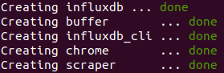
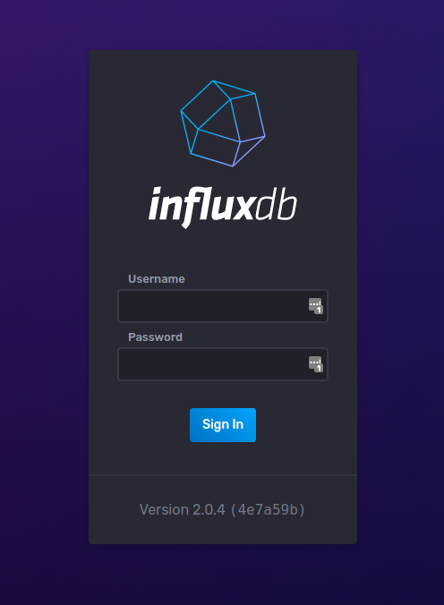
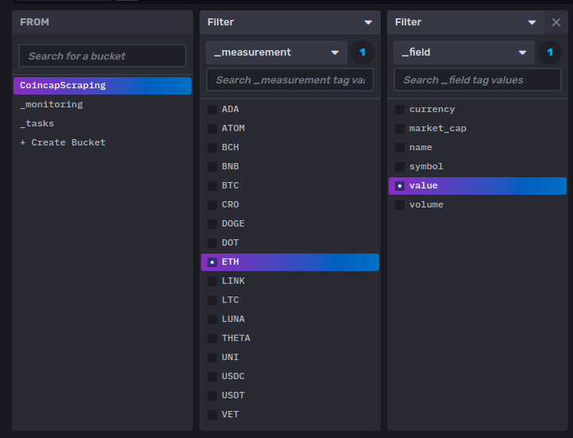
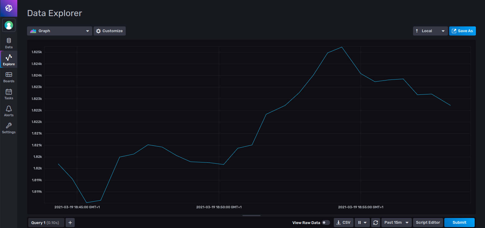

## INSTALLATION

Start by cloning this repository.

```bash
git clone https://github.com/ChainYo/scraping
```

Go to the cloned repository and add `.env` file.

```bash
cd path/to/scraping
nano .env
```

Add this to the `.env` file. You can choose everything by your own.

```bash
INFLUXDB_USERNAME=<your username>
INFLUXDB_PASSWORD=<your password>
INFLUXDB_V2_DB=<your db name>
INFLUXDB_V2_TOKEN=<your token>
INFLUXDB_V2_ORG=<your organisation name>
INFLUXDB_V2_BUCKET=<your bucket name>
```

The last thing to do is to run the containers with this following command:

```bash
docker-compose up -d
```

The images will be built on your computer. When everything is done you should see this screenshot.



You can check everything is running well with `docker ps`.

## Monitoring Scraping

`InfluxDB` is open on the port `8086`, go on http://localhost:8086/ .  
You land on this signin window, use your credentials you added in your `.env` file.  



Go to `Explore` on the left panel, choose `CoincapScraping` as your bucket. You only need to choose which filters you want for your Dashboard and use the `Submit` to show the datas.

*Maybe you will have to wait a bit because the scraper needs time to scrape data and add it to the database.*

These are the filters:



Finally, you can obtain this kind of graphs after 10 to 15 minutes of scraping (don't forget to change the time range).



## Technologies used

- **Docker**: Because it's a good practise to containerize your apps on the same network to make them communicate easily. Plus, only one command to launch everything is pretty cool.

- **Selenium**: Fast and easy to scrape the datas you need.

- **InfluxDB**: I didn't know anything about this database but it seemed to be good for TimeSeries datas. I chose to use it in combination with Grafana, but I saw `InfluxDB` had already some data visualization tools included. So, it was a good call to learn using it.

---

You can fork and modify this repository to play with scraping and influxdb.

If my work was useful, you can star this project by clicking on the little star in the top right corner of the github page.